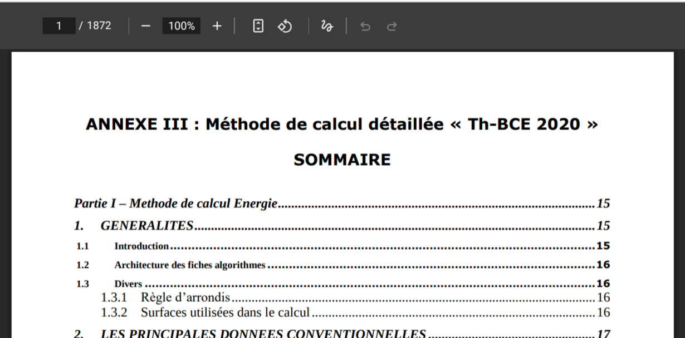
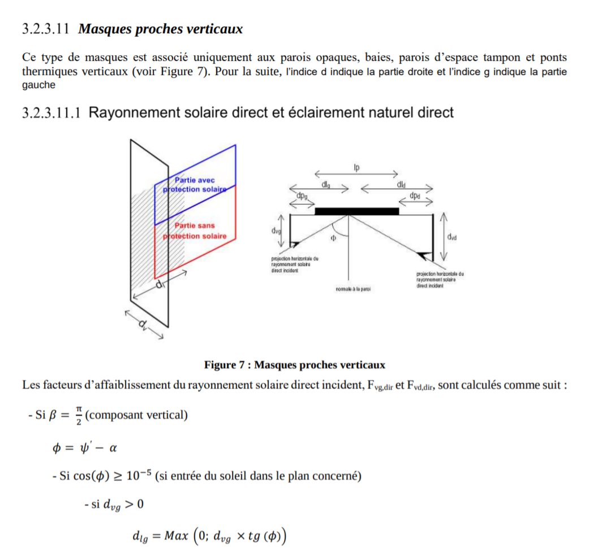

# Claude Code

```
npm install -g @anthropic-ai/claude-code
```

```
$ claude
```


---

# Claude Code

https://conductor.build/ - UI for Mac, allows running multiple Claude Code instances


---

# Claude Code

Has access to all files within current directory:

```
cd my-code
$ claude
```
---

# Claude Code

Previous sessions are kept.

Resume previous session for current directory:

```
$ claude --continue  # resumes last session
$ claude --resume    # allows you to pick the session to resume
```

---

# Claude Code vs Claude

Claude: LLM

Claude Code:

- Coding Agent
- Uses Claude Opus / Sonnet as its LLM
- Has various built-in tools (Read, Write, Search)
- Specialized system prompt instructing the LLM to act as a coding agent
- And more...

---

# Prompting

System prompt:

```
You are Claude Code, Anthropic's official CLI for Claude.

You are an interactive CLI tool that helps users with software engineering
tasks. Use the instructions below and the tools available to you to assist the
user.

IMPORTANT: Assist with defensive security tasks only. Refuse to create, modify,
or improve code that may be used maliciously. Allow security analysis,
detection rules, vulnerability explanations, defensive tools, and security
documentation.
[...]
```

Get the full prompt with:
```
npx @mariozechner/claude-trace --include-all-requests
```

---

# Prompting

### Code discovery

> Explain the project structure to me

### Implementation

> Add a test for foo.py

<br />

Lots more at https://docs.anthropic.com/en/docs/claude-code/common-workflows

---

# Meta-prompting

> Create a full software specification for a webbased application that can teach kids to spell words.

Use any tool: ChatGPT, Gemini, NotebookLM etc.

---

# Iterative specification

* > Can you create an application for kids to teach them to spell

* > Make it so that all the letters of the word are already shown and they only have to choose them in the right order
 
* > Can you make it nicer looking

* > Now based on what I told you, create a full specification of the application that I can give to a coding agent that allows it to build this application fully autonomously.

---

# Role playing

* > You're a UX designer. Look at the design of this game and make it so that it's both engaging and intuitive for kids.

* > You're a program manager. Plan the milestones and phases for the implementation of the software specification.

---

# Planning

> Start by creating a detailed plan and store this in a document under docs/implementation-plan/. Keep track of your progress by updating the doc or by creating new documents as needed under docs/implementation-plan/

```
docs/implementation-plan/
├── milestone-1/
│   ├── phases/
│   │   ├── phase7-testing-infrastructure.md
│   │   └── phase8-heating-control.md
│   └── reflection-points/
├── milestone-2/
```

---

# Getting advanced

- CLAUDE.md
- Commands
- MCP
- Subagents

---

# CLAUDE.md

- Add any instructions that Claude should always follow to CLAUDE.md:

  ```
  $ cat CLAUDE.md

  Always commit your changes in a new branch. Name the branch name
  after the Jira ticket, e.g. feat(DEP-1165). If you don't have the
  Jira ticket number, ask the user.
  ```

- Or use the `#` command inside Claude Code, which adds it to CLAUDE.md

  ```
  > # Always commit your changes in a new branch
  ```

---

# CLAUDE.md

Add CLAUDE.md to subdirectories, to give more specific instructions:

```
$ cat reference-data/CLAUDE.md

NEVER change any files in this directory.
```

---

# Commands

If you find yourself giving the same prompt over and over, use a command:

```
$ cat .claude/commands/commit.md

Commit and push your changes using a descriptive message.
```

<br />

```
> /commit
```

---

# MCP

Allows your coding agent to connect to other services:

- Atlassian
- Datadog
- Create your own (it's easy!)

---

# MCP

Each MCP server creates a set of tools:

`mcp__atlassian__getJiraIssue`

or simply:

`getJiraIssue`

---

# MCP

Each tool has a description:

- getJiraIssue: Get the details of a Jira issue by issue id or key.

This allows Claude Code to invoke the tool based on context:

```
> Give me the Jira details for ticket DEP-1165
```

Or you can invoke the tool more explicitly (any format works):

```
> /getJiraIssue(DEP-1165)
```

---

# Subagents

- Specialized agents which don't share the context with the "main" agent
- Focused on a single role

---

# Subagents

Use: `/agents`, which will guide you on how to set one up.

> You are an expert software engineer specializing in code review and ensuring adherence to project-specific developer guidelines. Your primary responsibility is to review staged git changes and verify they comply with the guidelines specified in @docs/developer-guidelines.md

---

# Subagents

```
> Use the review-changes agent to review your changes
```

Or make Claude use it automatically by adding it to CLAUDE.md:

```
> # Always use the review-changes agent before committing changes.
    Address any feedback before committing.
```


---

# Debugging MCP


```
npx @modelcontextprotocol/inspector
```

---

# Claude trace

```
npx @mariozechner/claude-trace --include-all-requests
```

---

# Implementing a large project

---

# RE2020

France's environmental regulation for **new buildings**, aiming to:

- reduce their **carbon footprint**
- improve **energy performance** and **summer comfort**
- promote **sustainable materials** throughout their entire lifecycle

---

- ## I don't know any TypeScript
* ## I don't know anything about RE2020

---

# Try 1: **Lovable.dev**

* ## ✅ Looks nice
* ## ❌ It's completely wrong

---

# Try 2: **Claude Code**

Implement the official specification

---



---



---

# Learnings from first try

Agents will:

- Second guess, make assumptions, imagine things
- Easily get distracted from the main goal
- Always take the shortest path

---

## Agents take the shortest path

- Change the test to make it pass instead of fixing the bug
- Fix the bug but don't update the test
- Fix the bug and update the test but don't fix the underlying
  architectural issue

---

## Agents: **Coders**, not **Software Engineers**

---

# Attempts at making better use of them

* **Attempt 1**: Micromanaging
* **Attempt 2**: Guiding
* **Attempt 3**: Feedback loops for self-improvement

---

# Attempt 1: Micromanaging

> Make the test pass means **FIXING THE BUG**, NOT CHANGING THE TEST

---

# Attempt 2: Guiding

Tell agents to:
- Plan, break up a problem into smaller tasks
- Look at an issue from multiple angles (role playing)
- Reflect and write down learnings and future improvements
- Create guidelines, best practices to follow

---

## Prompt

```
The goal is to create an implementation of the Th-BCE 2020 method. Read docs/comprehensive-software-specification.md for the detailed specification.

If you have any doubts or questions about the Th-BCE 2020 method while implementing, always check the authoritative sources before proceeding:

* @docs/authoritative-sources

Important: while building this implementation, *think* and *pause* to make sure you answered all your questions by looking at the documents. After finishing 
each step, reflect if you had any doubts or questions, then review the documentation again.

Implementing Th-BCE 2020 method will likely require quite some debugging, testing and iteration, so let's
make the code:

* easy to test
* easy to debug
* easy to maintain
* easy to extend
* well documented

Make sure to create new documents as you find clarifications to your questions, or as you make important decisions that others
will need to know about. Start by creating a detailed plan and store this in a document under docs/implementation-plan/. Keep
track of your progress by updating the doc or by creating new documents as needed under docs/implementation-plan/

Again: after finishing each step, pause and reflect whether you had any doubts or questions about the implementation. If you did, either look at the 
authoritative sources to answer your questions and make changes as needed, or write down your questions in a document so you don't forget about them.

This is a very large implementation. The official description of Th-BCE 2020 is extremely long and detailed.

Work methodologically. Work step by step. Frequently pause and reflect.
```

---

## Planning

> Start by creating a detailed plan and store this in a document under docs/implementation-plan/. Keep track of your progress by updating the doc or by creating new documents as needed under docs/implementation-plan/

```
docs/implementation-plan/
├── milestone-1/
│   ├── phases/
│   │   ├── phase7-testing-infrastructure.md
│   │   └── phase8-heating-control.md
│   └── reflection-points/
├── milestone-2/
```

Keeps them focused on the end-goal, prevents them from getting side-tracked.

---

## Planning


* ```
    $ cat .claude/commands/continue.md
    [...]
    Before continuing:
    1. Update the phase plan: docs/implementation-plan/milestone-XX/phases/
    2. Update the milestone: docs/implementation-plan/milestone-XX/README.md
    3. Create a new phase plan as needed
  ```
* ```
    ● Perfect! I've successfully implemented phase 2 of milestone 1.

    > /continue
  ```

---

## Role playing

> You're a **UX designer**. Take a critical look at the selection steps and look for ways to improve the current design.  Write down your plan in a new phase under docs/implementation-plan/

```
[...]
Issues Identified:
- Too much information density in cards can overwhelm users                     

Implementation:                                                                 
- Use progressive disclosure more effectively                                   
```

---

## Reflection

- `/resolve-doubts`
- ```
  $ cat .claude/commands/resolve-doubts.md
  [...]
  Write down any important findings, learnings, questions, and todos in
  a reflection points document

  Reflection points: docs/implementation-plan/milestone-XX/reflection-points/
  ```

---

## Reflection

Use the reflection docs for later analysis

> Take a look at all reflection documents under docs/implementation-plan/milestone-1/reflection-docs and think of ways we could have prevented the issues that are mentioned there. Order the improvements by **priority**, and create a **plan** to implement them.

---

## Exhaustive plan

* Specification ambiguity tracking
  ```typescript
  // AMB-003: Solar gains distribution
  const GAIN_DISTRIBUTION = {
    fsa: 0.1,   // Direct to air - AMB-003
    frsd: 0.45, // To surface - AMB-003  
  ```
* Physics invariants catch fundamental bugs
* 1,200+ tests
* **But it wasn't using any of it**

---

## I should have known

- Take the shortest path
- Any checks not run automatically will not be run

---

# Attempt 3: Feedback loops for self-improvement

* > This codebase is almost entirely maintained by a coding agent. so when thinking about improvements for maintainability, correctness, etc., we should gear towards solutions that work well for coding agents. Can you mention this in CLAUDE.md

---

## CLAUDE.md

This codebase is maintained by coding agents. Design systems that guide agents to success.

---

- **Executable validation**: `npm run validate` returns JSON with specific fixes - agents will run this
  ```json
  {
    "status": "fail",
    "requiredActions": ["Fix TypeScript errors"],
    "suggestedCommands": ["npm run typecheck"],
    "canProceed": false
  }
  ```

- **Type system enforcement**: Branded types make wrong units fail at compile time
- **Loud failures**: Clear errors with values ("Temperature -100°C below minimum -50°C")

---

What makes agents fail:
- **Hidden knowledge**: Information not at point of use gets missed
- **Silent problems**: Issues that compile but compute wrong values
- **Undiscoverable tools**: Scripts without npm entries rarely get found

---

Building agent-friendly tools:
- Add to `npm run validate` output
- Make wrong code fail to compile
- Put warnings in code comments
- Create pre-commit hooks that block
- Include example commands in error messages

---

## Feedback loops

- Reflection documents
- Automatic validation

## Automatic validation

1. Always run `npm run validate` after each command
2. Analyze what worked and what didn't
3. Update agent instructions (CLAUDE.md)
4. Improve continuously

---

# Generate Insight Docs

- Implementation reflections
- Blog articles
- Technical documentation

**89 reflection documents** captured learnings

---

# Parallelize Work

Spawn multiple agents for:
- TypeScript error fixing
- Test updates
- Documentation

**73 errors fixed in parallel**

---

# Building for Agents

- **Loud failures** with clear messages
- **Executable documentation** (CLAUDE.md)
- **Pre-commit hooks** that block errors
- **One-command validation**

---

# Using commands

```
.claude/commands/resolve-doubts.md
```

```
[...]

**Reflection points:** docs/implementation-plan/milestone-XX/reflection-points/
- Follow format in CLAUDE.md and template.md
- Reference in milestone README
- Alows write down any important findings, learnings, questions, and todos in
  a reflection points document

[...]

## Next steps
**Continue only after** reflecting on doubts, checking sources, and documenting findings.
```

---

# Using specialized subagents

- **thbce-spec-verifier**: Check spec compliance
- **engineering-guidelines-reviewer**: Verify code quality

```
$ cat .claude/commands/resolve-doubts.md
[...]
Before committing any changes, use the thbce-spec-verifier agent to verify that your changes are according to spec.

After that, use the engineering-guidelines-reviewer agent to review your code.

If both found no violations, then commit changes with descriptive messages. Otherwise, ask the user how they want to continue.
```

---

# Leverage the Agent to improve itself

- Have it reflect on its implementation
- Document its learnings
- Make it think about how to make agents success

---

# What Makes Agents Fail

- Hidden knowledge not at point of use
- Silent problems that compile
- Optional steps (will be skipped)
- Undiscoverable tools
